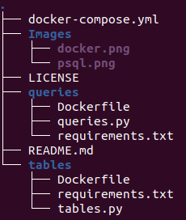

# SQL & docker

 

The main purpose of this project is to practice docker-compose and sql.

## 1st step
Built a database called 'company' which consists of three tables:
- departments;
- regions;
- employees.
The database is dockerized and created by using sqlalchemy.

## 2nd step 
Practicing queries:
- aggregate functions;
- subqueries;
- case;
- join table.

## Structure

- docker-compose.yml is the file that make everything possible, there are all the istruction for the containers;
- tables directory is the one responsible to create all the tables;
- queries directory will start after all the tables are created and contain all the queries.

## Let's the music start 

sudo docker-compose up (inside the directory where .yml file is located) is like Herbert Von Karajan directing the Berliner Philharmoniker, it will run all the containers.
Setting time.sleep() inside .py files is crucial to create all the tables one by one and then running the queries in this precise order.

